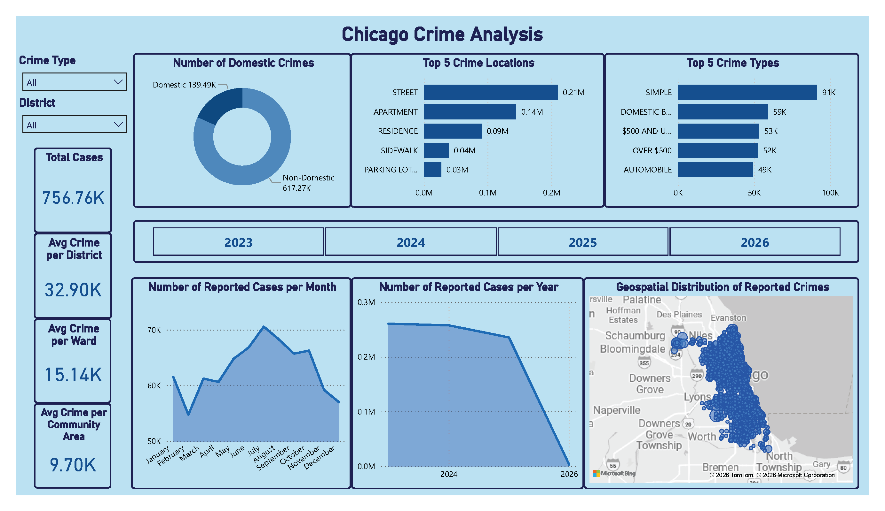

# 📊 Chicago Crime Analysis Dashboard

## 🔎 Project Overview

This project analyzes reported crime incidents in **Chicago (2001–January 2026)** to identify:

- Crime volume trends
- Domestic vs non-domestic distribution
- High-risk districts and wards
- Geographic crime concentration
- Top crime locations and types

The objective is to transform raw crime records into **actionable insights** for urban safety planning and public policy analysis.

---

## 🎯 Business Problem

City stakeholders require insights to answer:

- Which districts report the highest number of crimes?
- What are the most common crime types?
- How do domestic and non-domestic cases compare?
- Are crime volumes increasing or decreasing over time?
- Which locations are most affected?

---

## 📂 Dataset

**Source:** Chicago Crimes – 2001 to January 2026

The dataset includes:

| Column | Description |
|---|---|
| Case ID | Unique crime incident identifier |
| Date & Updated On | Incident timestamp |
| Primary Type | Primary crime category |
| Location Description | Where the crime occurred |
| Arrest | Whether an arrest was made |
| Domestic | Domestic incident flag |
| District / Ward / Community Area | Geographic groupings |
| Latitude / Longitude / X / Y | Geographic coordinates |

---

## 🧹 Data Cleaning & Transformation (Power Query)

The following transformations were performed using **Power Query (M language)**:

### 1️⃣ Header Promotion

Converted the first row into proper column headers.

```m
Table.PromoteHeaders(Source, [PromoteAllScalars=true])
```

---

### 2️⃣ Date Type Standardization (Locale-Aware)

Ensured correct datetime parsing and prevented misinterpretation of month/day formats. Also applied to the `Updated On` column.

```m
Table.TransformColumnTypes(..., {{"Date", type datetime}}, "en-US")
```

---

### 3️⃣ Data Type Optimization

Converted columns into appropriate types for better performance, memory efficiency, and model reliability:

| Column | Type |
|---|---|
| Arrest | Logical |
| Domestic | Logical |
| Beat, District, Ward, Community Area, Year | Whole Number |
| X Coordinate, Y Coordinate, Latitude, Longitude | Decimal |

---

### 4️⃣ Data Quality Filtering

Removed rows without geographic coordinates to ensure accurate map visualizations:

```m
Table.SelectRows(... each ([X Coordinate] <> null))
```

Filtered out incomplete ward records to maintain geographic consistency:

```m
Table.SelectRows(... each [Ward] <> null and [Ward] <> "")
```

---

### 5️⃣ Missing Value Handling

Replaced blank `Location Description` values with `"NOT STATED"` to ensure cleaner grouping in visuals:

```m
Table.ReplaceValue(...,"","NOT STATED",...)
```

---

## 🏗 Data Modeling Approach

The model is designed for analytical reporting with:

- **Fact table:** Crime incidents
- **Dimensional attributes:** Date, District, Ward, Community Area, Crime Type

**Optimized for:**
- Time-based analysis
- Geographic mapping
- Category segmentation

---
## 📸 Dashboard Preview


---

## 📊 Dashboard Overview

### 🔢 Key KPIs

| Metric | Value |
|---|---|
| Total Cases | 756.76K |
| Domestic Crimes | 139.49K |
| Non-Domestic Crimes | 617.27K |
| Avg Crime per District | 32.90K |
| Avg Crime per Ward | 15.14K |
| Avg Crime per Community Area | 9.70K |

---

### 📈 Time-Based Analysis

- Year-wise crime distribution
- Monthly crime trends
- Identification of peak months

---

### 📍 Geographic Analysis

- Interactive geospatial crime distribution map
- District-based filtering
- Ward-level aggregation

---

### 🏢 Top 5 Crime Locations

| Rank | Location | Volume |
|---|---|---|
| 1 | Street | ~0.21M |
| 2 | Apartment | ~0.14M |
| 3 | Residence | ~0.09M |
| 4 | Sidewalk | ~0.04M |
| 5 | Parking Lot | ~0.03M |

---

### 🔎 Top 5 Crime Types

| Rank | Crime Type | Count |
|---|---|---|
| 1 | Simple Assault | ~91K |
| 2 | Domestic Battery | ~59K |
| 3 | Theft ≤ $500 | ~53K |
| 4 | Theft > $500 | ~52K |
| 5 | Automobile Theft | ~49K |

---

## 📈 Key Insights

- Non-domestic crimes **significantly exceed** domestic cases
- **Streets and residential areas** are primary crime hotspots
- Crime concentration **varies substantially** by district
- **Theft-related offenses** remain among the most frequent categories

---

## 💡 Recommendations

- Increase patrol presence in **high-frequency districts**
- Deploy preventive strategies in **street and residential zones**
- Launch targeted **theft prevention programs**
- Conduct deeper temporal analysis to allocate **night-time resources** effectively

---

## 📥 Download Full PBIX File

👉 **Google Drive Download:**
[(https://drive.google.com/file/d/1Lc8MVwJv1MstsOnTwSJkLb07qGMrqbcF/view?usp=drive_link)]

---

## 🛠 Tools Used


- Power BI Desktop
- Power Query (M Language)
- DAX
- Data Modeling
- Geospatial Mapping
  
